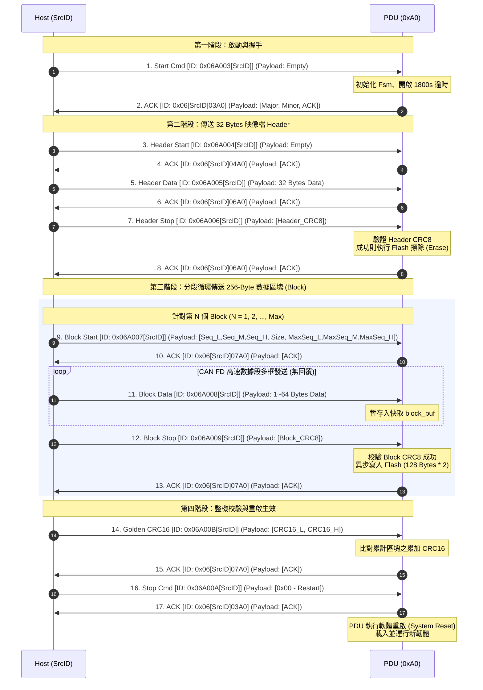

# PDU 基於 CAN FD 之韌體更新通訊規格書

本規格書定義了 **PDU (Power Distribution Unit)** 基於 CAN FD 實體層與 AWS 擴充協議層 (Extended CAN ID 29-bit) 下的韌體更新 (Firmware Update) 協議、各指令定義、資料內容與狀態轉移流程。

---

## 1. 29-bit CAN ID 欄位配置與 PDU 位址定義

本專案採用 29-bit 擴充 CAN ID (Extended CAN ID) 的格式，定義如下：

| 位元區間 (Bits)      | 欄位名稱 (C Macro 定義) | 說明                                                        |
|:---------------------|:------------------------|:------------------------------------------------------------|
| **[28:24]** (5 bits) | `Comm Type`             | 通訊類別。韌體更新 `AWS_COMM_TYPE_FW_UPD` 定義為 **`0x06`**。 |
| **[23:16]** (8 bits) | `Target Device ID`      | 接收端的裝置實體位址。                                       |
| **[15:8]** (8 bits)  | `Command Code`          | 韌體更新的具體子指令碼 (Cmd Code)。                          |
| **[7:0]** (8 bits)   | `Source Device ID`      | 發送端的裝置實體位址 (例如 Host 端 / Gateway 記為 `SrcID`)。 |

### 1.1 裝置實體位址 (Device ID) 推導與 PDU Address
Device ID (8 bits) 是由 **Device Type** 與 **Device Number** 組合而成：
- **Bits [7:5]** (3 bits)：`Device Type` (裝置類型)
- **Bits [4:0]** (5 bits)：`Device Number` (裝置序號，單一類別最多 31 台)

根據 `aws_device_type_e` 列舉定義，各裝置的類別編號與初始 (廣播) 位址如下：

$$Device\ ID = (Device\ Type \times 32) + Device\ Number$$

| 裝置類型 (Device Type)         | 列舉值 (Dec) | 運算式 (Binary) | 預設初始位址 / 廣播位址 (Hex) |
|:-------------------------------|:------------:|:---------------:|:-----------------------------:|
| **AWS_DEVICE_TYPE_BROADCAST**  |      0       |   `000b << 5`   |            `0x00`             |
| **AWS_DEVICE_TYPE_ATS**        |      1       |   `001b << 5`   |            `0x20`             |
| **AWS_DEVICE_TYPE_PSU**        |      2       |   `010b << 5`   |            `0x40`             |
| **AWS_DEVICE_TYPE_BBU**        |      3       |   `011b << 5`   |            `0x60`             |
| **AWS_DEVICE_TYPE_PSC**        |      4       |   `100b << 5`   |            `0x80`             |
| **AWS_DEVICE_TYPE_PDU** (本案) |    **5**     |   `101b << 5`   |          **`0xA0`**           |

> **理解結論**：當 PDU 初始位址為 **`0xA0`** 時，符合其裝置類別 `AWS_DEVICE_TYPE_PDU = 5` 的定義位址（即 `5 << 5 = 0xA0`），代表 Device Number = 0 的首台 PDU 裝置。

---

## 2. 基於 CAN FD 的韌體更新指令集

在 `AWS_COMM_TYPE_FW_UPD` (`0x06`) 底下，定義了 9 個核心指令。

> **重要細節說明**：
> - 由於 CAN FD 具備最大 64-byte Payload 特性，因此 256-byte 區塊的傳輸可分段以多個 CAN FD 訊框（例如 32 或 64-byte）高速發送。
> - 在 PDU 回覆 (Reply) 時，CAN ID 的 `Target` 與 `Source` 會對調：
>   - **請求 ID**：`0x06` + `[PDU_Addr]` + `[CmdCode]` + `[SrcID]`
>   - **回覆 ID**：`0x06` + `[SrcID]` + `[Reply_CmdCode]` + `[PDU_Addr]`

### 指令詳情對照表

| 指令名稱                    | Command Code (Host 發送) | Payload 長度 & 欄位格式 (Host $\to$ PDU)                                                                 | Reply Cmd Code | Payload 長度 & 欄位格式 (PDU $\to$ Host)                                                                  | 說明與內部行為                                                                                                                        |
|:----------------------------|:------------------------:|:---------------------------------------------------------------------------------------------------------|:--------------:|:----------------------------------------------------------------------------------------------------------|:--------------------------------------------------------------------------------------------------------------------------------------|
| **FW_UPD_START_CMD**        |        **`0x03`**        | `0 bytes` (空)                                                                                           |   **`0x03`**   | `3 bytes` • Byte 0: Major Version • Byte 1: Minor Version • Byte 2: `ACK` (0x00) / `NACK` (0x01) | **啟動韌體更新** 重設快取與狀態、啟動 1800 秒逾時定時器，進入 `WAITING_AWS_HEADER` 狀態。                                             |
| **FW_UPD_HEADER_START_CMD** |        **`0x04`**        | `0 bytes` (空)                                                                                           |   **`0x04`**   | `1 byte` • Byte 0: `ACK` / `NACK`                                                                      | **開始傳送 Header** 驗證當前狀態，清空 AWS Image Header 緩存。                                                                       |
| **FW_UPD_HEADER_DATA_CMD**  |        **`0x05`**        | `32 bytes` • AWS Image Header 數據                                                                    |   **`0x06`**   | `1 byte` • Byte 0: `ACK` / `NACK`                                                                      | **傳送 Header 數據** 長度固定為 32 bytes。完成後進入 `AWS_HEADER_RECEVIED` 狀態。 *(注意：回覆之 CmdCode 為 0x06)*                 |
| **FW_UPD_HEADER_STOP_CMD**  |        **`0x06`**        | `1 byte` • Byte 0: Golden CRC8                                                                        |   **`0x06`**   | `1 byte` • Byte 0: `ACK` / `CRC_FAIL` (0x05)                                                           | **結束 Header 傳送** 校驗 Header CRC8。成功後觸發 Flash 重置與擦除 (`BOOT_CMD_INST_ERASE`)，並進入 `HEADER_VERIFIED` 狀態。           |
| **FW_UPD_BLOCK_START_CMD**  |        **`0x07`**        | `7 bytes` • Byte 0~2: Block Seq (區塊序號) • Byte 3: Block Size (256) • Byte 4~6: Max Block Seq |   **`0x07`**   | `1 byte` • Byte 0: `ACK` / `NACK`                                                                      | **開始傳送區塊** 確認當前 Block 序號是否連續、最大長度是否合法，準備接收 256 bytes 的 Block 數據。                                    |
| **FW_UPD_BLOCK_DATA_CMD**   |        **`0x08`**        | `1 ~ 64 bytes` • 韌體 Binary 數據段                                                                   |   **無回覆**   | -                                                                                                         | **傳送區塊數據段** 利用 CAN FD 高頻寬連續寫入快取 `block_buf`。PDU **不予即時回覆**以最大化傳輸速率。                                |
| **FW_UPD_BLOCK_STOP_CMD**   |        **`0x09`**        | `1 byte` • Byte 0: Golden CRC8                                                                        |   **`0x07`**   | `1 byte` • Byte 0: `ACK` / `CRC_FAIL` / `NACK`                                                         | **結束區塊傳送 & 寫入** 比對此 256 bytes 的 CRC8，若成功則調用底層驅動寫入 Flash，累加整機 CRC16。 *(注意：回覆之 CmdCode 為 0x07)* |
| **FW_UPD_CRC16_CMD**        |        **`0x0B`**        | `2 bytes` • Byte 0~1: Golden CRC16                                                                    |   **`0x07`**   | `1 byte` • Byte 0: `ACK` / `CRC_FAIL` / `NACK`                                                         | **整機韌體驗證** 驗證全部接收數據的累加 CRC16 是否正確。 *(注意：回覆之 CmdCode 為 0x07)*                                         |
| **FW_UPD_STOP_CMD**         |        **`0x0A`**        | `1 byte` • Byte 0: `0x00` (Restart) / `0x01` (Abort)                                                  |   **`0x03`**   | `1 byte` • Byte 0: `ACK` / `NACK`                                                                      | **結束更新並重啟** 若為 0x00 且 ACK 則呼叫軟體重啟 (`BOOT_CMD_INST_RESET`)，加載新韌體。 *(注意：回覆之 CmdCode 為 0x03)*          |

---

## 3. 韌體更新完整交互流程圖

以下是 Host (主機/網關) 與 PDU (初始位址 `0xA0`) 之間完整的通訊流程圖：

---

## 4. 異常處理與保護機制
1. **傳輸逾時機制**：啟動後會開啟 `1800秒` (30分鐘) 的逾時防護，若逾時未完成則強制退出更新模式。
2. **區塊序號驗證**：在 `Block Start` 階段，PDU 會嚴格比對 `block_seq` 是否恰好為 `current_block_seq + 1` 且未大於 `max_block_seq`。不滿足即拒絕，避免發生數據遺漏。
3. **多重安全校驗 (CRC8 + CRC16)**：
   - 32-byte Header 校驗：CRC8
   - 每個 256-byte 區塊校驗：CRC8
   - 整機 Image 校驗：CRC16
4. **回傳錯誤碼機制**：校驗或狀態不符時，PDU 會回覆 NACK 或對應錯誤碼（如 `AWS_PROTOCOL_FWUPD_CRC_FAIL` `0x05` ），終止本次下載，防範不良映像檔寫入運作。
